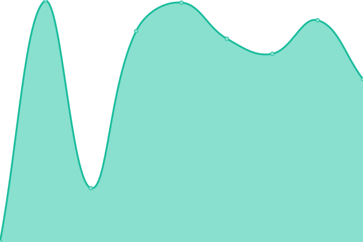
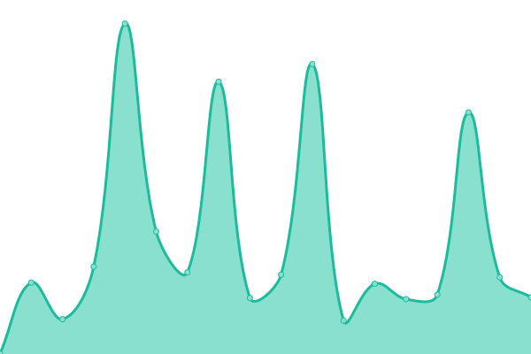
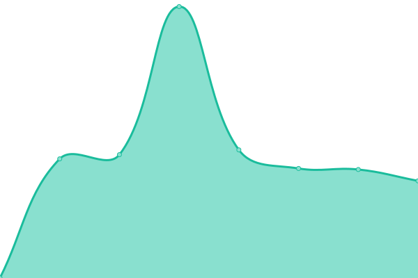
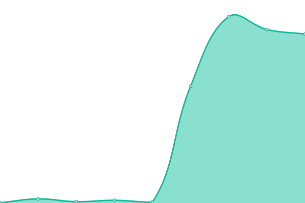
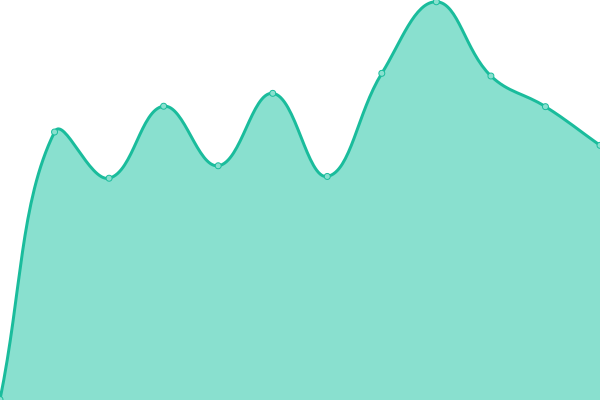

# [📈 Live Status](https://demo.upptime.js.org): <!--live status--> **🟧 Partial outage**

This repository contains the open-source uptime monitor and status page for [SOPORTEAYIGROUP](https://demo.upptime.js.org), powered by [Upptime](https://github.com/upptime/upptime).

With [Upptime](https://upptime.js.org), you can get your own unlimited and free uptime monitor and status page, powered entirely by a GitHub repository. We use [Issues](https://github.com/SOPORTEAYIGROUP/AYIGROUP/issues) as incident reports, [Actions](https://github.com/SOPORTEAYIGROUP/AYIGROUP/actions) as uptime monitors, and [Pages](https://demo.upptime.js.org) for the status page.

<!--start: status pages-->
<!-- This summary is generated by Upptime (https://github.com/upptime/upptime) -->
<!-- Do not edit this manually, your changes will be overwritten -->
<!-- prettier-ignore -->
| URL | Status | History | Response Time | Uptime |
| --- | ------ | ------- | ------------- | ------ |
|  [Internet EPEC](190.96.117.110) | 🟥 Down | [internet-epec.yml](https://github.com/SOPORTEAYIGROUP/AYIGROUP/commits/HEAD/history/internet-epec.yml) | 

 414ms
     
 | 

<a href="https://SOPORTEAYIGROUP.github.io/AYIGROUP/history/internet-epec">0.00%</a>
    

|  [CAOS](http://caos.ayi-asociados.com/) | 🟩 Up | [caos.yml](https://github.com/SOPORTEAYIGROUP/AYIGROUP/commits/HEAD/history/caos.yml) | 

 752ms
     
 | 

<a href="https://SOPORTEAYIGROUP.github.io/AYIGROUP/history/caos">100.00%</a>
    

|  [Gitlab Ayigroup](https://gitlab.ayi-asociados.com/) | 🟥 Down | [gitlab-ayigroup.yml](https://github.com/SOPORTEAYIGROUP/AYIGROUP/commits/HEAD/history/gitlab-ayigroup.yml) | 

 388ms
     
 | 

<a href="https://SOPORTEAYIGROUP.github.io/AYIGROUP/history/gitlab-ayigroup">37.97%</a>
    

|  [Ayi Academy](https://ayi.academy/) | 🟩 Up | [ayi-academy.yml](https://github.com/SOPORTEAYIGROUP/AYIGROUP/commits/HEAD/history/ayi-academy.yml) | 

 1216ms
     
 | 

<a href="https://SOPORTEAYIGROUP.github.io/AYIGROUP/history/ayi-academy">100.00%</a>
    

|  [Web Corporativa](https://ayi.group/) | 🟥 Down | [web-corporativa.yml](https://github.com/SOPORTEAYIGROUP/AYIGROUP/commits/HEAD/history/web-corporativa.yml) | 

 8ms
     
 | 

<a href="https://SOPORTEAYIGROUP.github.io/AYIGROUP/history/web-corporativa">0.00%</a>
    

|  [Web Inmuta](https://inmuta.com/) | 🟥 Down | [web-inmuta.yml](https://github.com/SOPORTEAYIGROUP/AYIGROUP/commits/HEAD/history/web-inmuta.yml) | 

 0ms
     
 | 

<a href="https://SOPORTEAYIGROUP.github.io/AYIGROUP/history/web-inmuta">0.00%</a>
    

|  [Web Interconomy](https://interconomy.biz/) | 🟥 Down | [web-interconomy.yml](https://github.com/SOPORTEAYIGROUP/AYIGROUP/commits/HEAD/history/web-interconomy.yml) | 

 0ms
     
 | 

<a href="https://SOPORTEAYIGROUP.github.io/AYIGROUP/history/web-interconomy">0.00%</a>
    

|  [CAOSBI](https://caosbi.ayi-asociados.com/) | 🟩 Up | [caosbi.yml](https://github.com/SOPORTEAYIGROUP/AYIGROUP/commits/HEAD/history/caosbi.yml) | 

 697ms
     
 | 

<a href="https://SOPORTEAYIGROUP.github.io/AYIGROUP/history/caosbi">89.14%</a>
    

<!--end: status pages-->

[**Visit our status website →**](https://demo.upptime.js.org)

## 📄 License

- Powered by: [Upptime](https://github.com/upptime/upptime)
- Code: [MIT](./LICENSE) © [SOPORTEAYIGROUP](https://demo.upptime.js.org)
- Data in the `./history` directory: [Open Database License](https://opendatacommons.org/licenses/odbl/1-0/)
